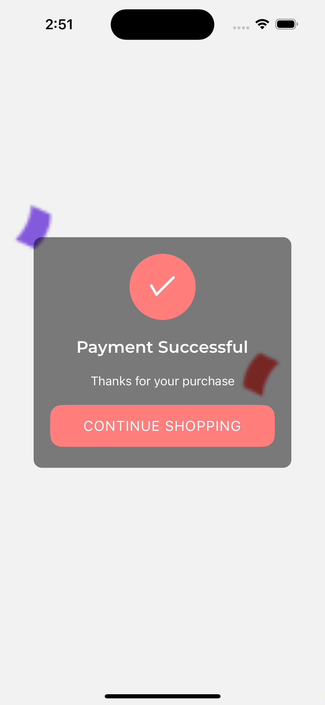
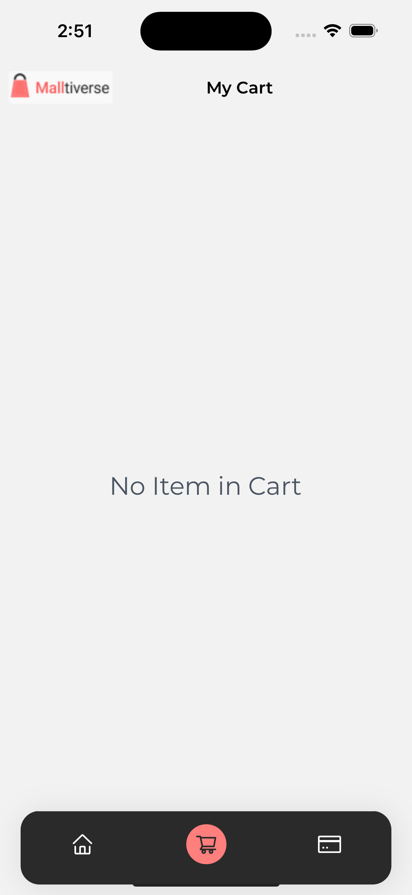

# Timbu Shopping App

This is an Update on the USER INTERFACE of the HNG Shopping App Task! This application allows users to simulate the experience of browsing products, view details, add them to a cart, and checkout.

Data fetched from the Timbu Api

## Table of Contents

- [Features](#features)
- [Setup Instructions](#setup-instructions)
- [Screenshots](#screenshots)
- [APK Download](#apk-download)
- [Usage](#usage)
- [Contributing](#contributing)
-

## Features

- Browse products
- Click on a product to view details
- Add products to cart
- Remove products from cart
- Adjust product quantities
- Checkout process

## Setup Instructions

### Prerequisites

- Node.js (version 14 or later)
- npm or yarn
- Expo CLI

### Installation

1. Clone the repository:

   ```sh
   git clone https://github.com/MakindeTobby/HNG-mobile-task-3.git
   cd HNG-mobile-task-3
   ```

2. Install dependencies:

   ```sh
   npm install
   # or
   yarn install
   ```

3. Start the development server:

   ```sh
   npm start
   # or
   yarn start
   ```

4. Use the Expo app on your phone to scan the QR code generated by the development server.

## Screenshots

### Product List


### Product Detail


### Checkout


### Order Successful



### Empty Cart



## APK Download

You can download the latest APK from the following link:

[Download APK](https://expo.dev/artifacts/eas/u5e155fZ53c1Qz4iFVftxp.apk)

## Usage

1. Browse through the product list.
2. Add items to your cart by clicking the "Add to Cart" button.
3. Adjust quantities to the cart as needed.
4. Proceed to checkout to place your order.

## Contributing

Contributions are welcome! Please fork the repository and submit a pull request with your changes. Ensure your code adheres to the project's coding standards and includes appropriate tests.

1. Fork the repository.
2. Create a new branch:
   ```sh
   git checkout -b feature/your-feature-name
   ```
3. Make your changes and commit them:
   ```sh
   git commit -m "Add some feature"
   ```
4. Push to the branch:
   ```sh
   git push origin feature/your-feature-name
   ```
5. Open a pull request.
